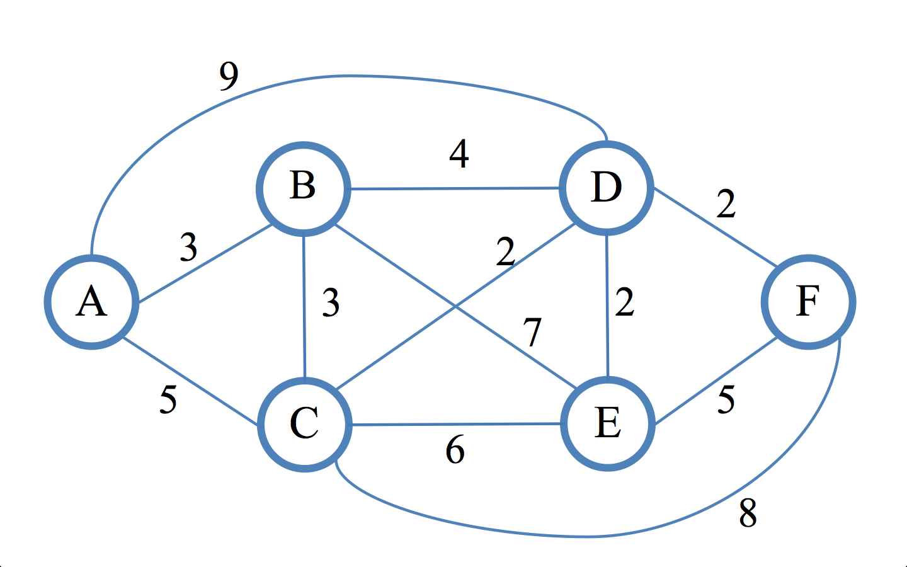

# Dijkstra's algorithm applied to R

Dijkstra's algorithm is a powerful deterministic graph theory algorithm articulated by the Dutch programmer and computer scientist Edsger Wybe Dijkstra in 1956 and first disclosed to the public in 1959. The underlying idea is to determine the **shortest path** between a given initial vertex (or node) connected by the intersection of the edges, and the rest of neighboring vertices or nodes of the graph by exploring all the paths that start from the initial vertex or node.

This is covered in more detail in [this article](https://sheikyon.nl/posts/assimilating-dijkstra-algorithm-and-its-applications-in-daily-life/), written by me.

This script is coded in R. You are free to do whatever you like with it.
